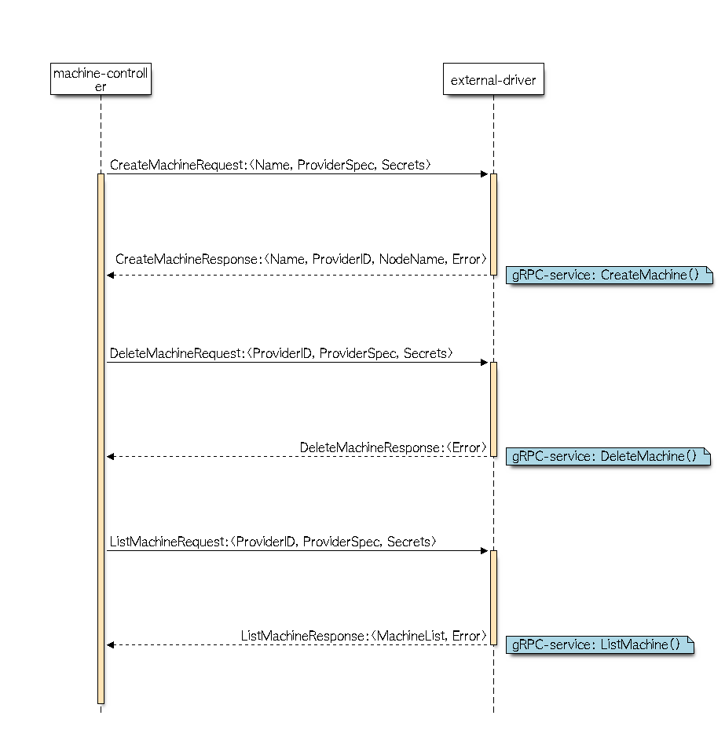

# Cluster Machine Interface - Drivers
This project contains the external/out-of-tree driver implementation of machine-controller-manager for AWS. This implementation adheres to the machine-interface defined at following project: 
- https://github.com/hardikdr/machine-spec

## Fundamental Design Principles:
Following are the basic principles kept in mind while developing the external driver.
* Communication between external driver and machine-controller is achieved using gRPC mechanism.
* External driver behaves as gRPC-server and machine-controller behaves as gRPC client.
* Cloud-provider specific contract should be scoped under `ProviderSpec` field. `ProviderSpec` field is expected to be raw-bytes at machine-controller-side. External driver should have pre-defined typed-apis to parse the `ProviderSpec` to make necessary CP specific calls.
* External drivers do not need to communicate with kubernetes api-server.
    * Kubeconfig may not be available to external-drivers.

## Sequence Diagram:

